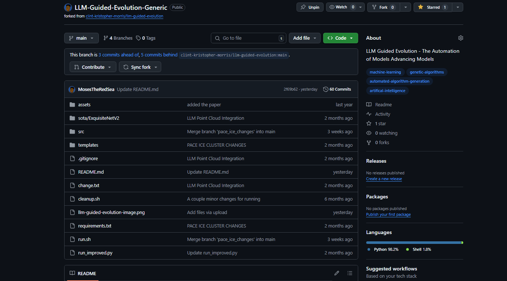
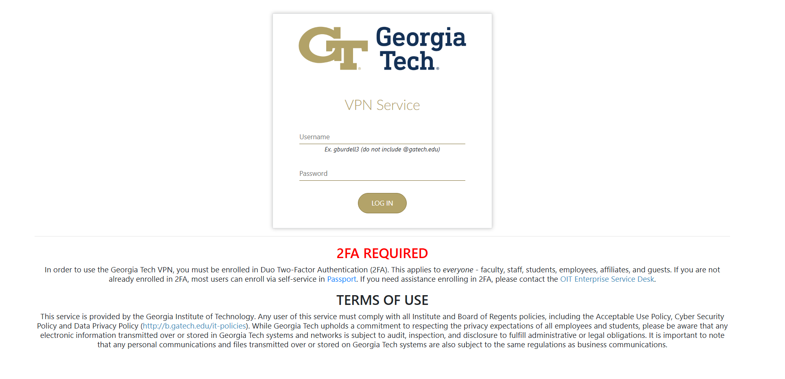
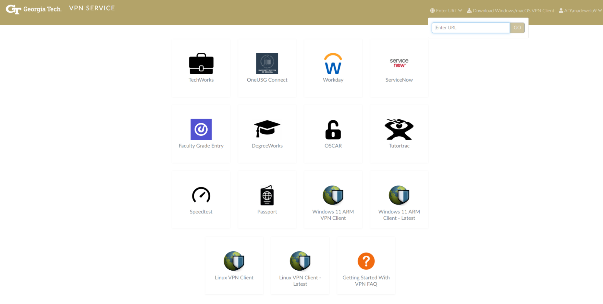

.. LLM-GE documentation master file, created by
   sphinx-quickstart on Mon May  5 22:08:05 2025.
   You can adapt this file completely to your liking, but it should at least
   contain the root `toctree` directive.

Point Cloud Classification Optimization
=======================================

Overview
--------

How to get started and setup your system for Point Cloud Classification Team 

Dr. Zutty's recent paper LLM Guided Evolution -- The Automation of Models Advancing Models. 
They were able to create a framework that uses LLMs with a layer of creativity to speed up the process of evolving ML models.
Our specific goal is to generalize this framework by improving 2 current state of the start point cloud classification models.
We picked Point Transformers and PointNet++ along with the Model40Net DataSet.

PointNet++
----------

PointNet++ extends PointNet by using a hierarchical approach to capture local geometric patterns in 3D point clouds. 
It samples and groups points into neighborhoods, applies PointNet-style operations to each group, and then propagates the learned features to progressively capture both local and global structures.

Point Transformers  
------------------

Point Transformers improves point cloud processing by using self-attention mechanisms, similar to those in transformer models for sequential data.
They apply attention to capture relationships between all points in the cloud, allowing the model to focus on relevant features and dependencies, both locally and globally, leading to better handling of irregular, unordered data.
For our purposes we're not using the EMADE Repo instead we'll be using the Large Language Model Guide Evolution Repo.

Code Base - Setup
-----------------

Github Repository
^^^^^^^^^^^^^^^^^

`MosesTheRedSea/LLM-Guided-Evolution-Generic: LLM Guided Evolution - The Automation of Models Advancing Models <https://github.com/MosesTheRedSea/LLM-Guided-Evolution-Generic>`_

This is the Link to the Github repository where we're implementing the 2 separate models.

Clone Repository
""""""""""""""""

Select the link you're given when you click the green button dropdown <> Code

.. code-block:: console
    
    git clone https://github.com/MosesTheRedSea/LLM-Guided-Evolution-Generic.git

Pace-Ice Setup
--------------

Important Links
^^^^^^^^^^^^^^^
`GATECH VPN <https://vpn.gatech.edu/global-protect/login.esp>`_
"""""""""""""""""""""""""""""""""""""""""""""""""""""""""""""""""""""""

* Username : gatech username - without @gatech.edu
* Password : gatech account password

You can access any website through the VPN through the ``enter url`` dropdown.

`PACE ICE <https://ondemand-ice.pace.gatech.edu/>`_
"""""""""""""""""""""""""""""""""""""""""""""""""""
.. note::
    You must be on the vpn to access pace.

.. toctree::
   :maxdepth: 2
   :caption: Contents:

