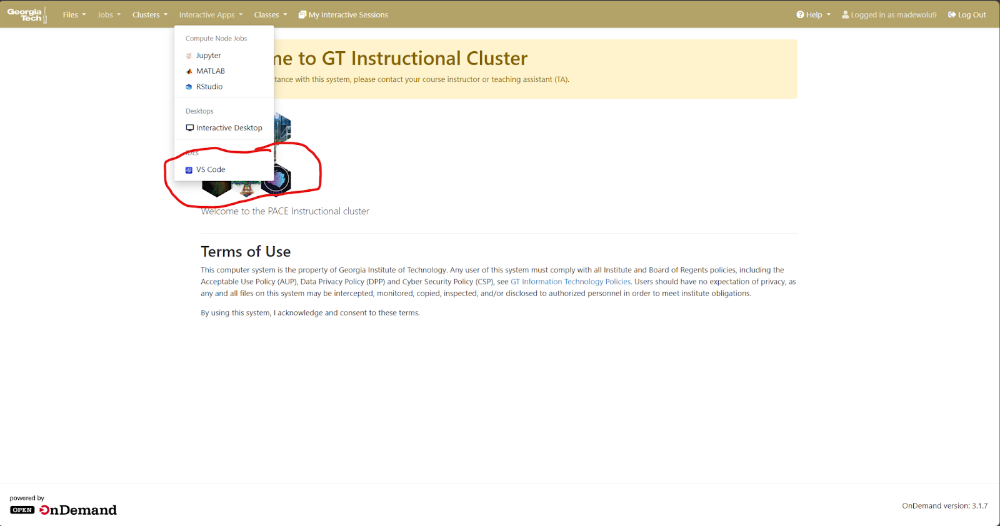
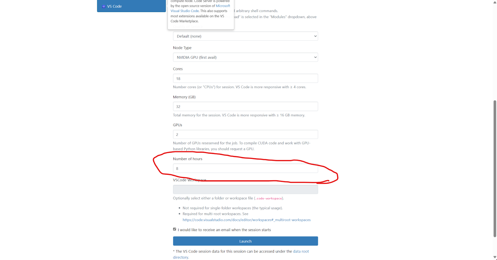
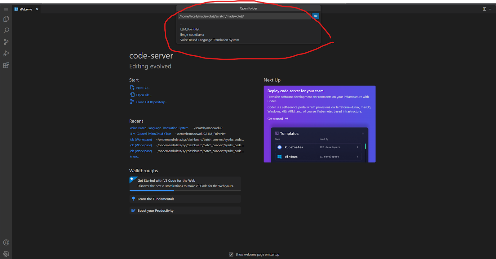
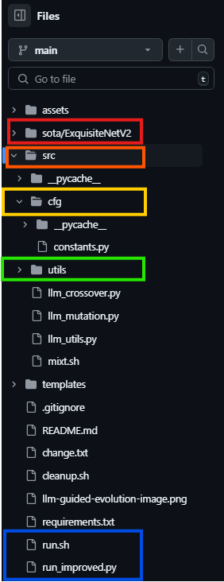

.. LLM-GE documentation master file, created by
   sphinx-quickstart on Mon May  5 22:08:05 2025.
   You can adapt this file completely to your liking, but it should at least
   contain the root `toctree` directive.

Point Cloud Classification Optimization
=======================================

Overview
--------

How to get started and setup your system for Point Cloud Classification Team 

In Morris, Jurado, and Zutty's recent paper "LLM Guided Evolution -- The Automation of Models Advancing Models", 
they were able to create a framework that uses LLMs with a layer of creativity to speed up the process of evolving ML models.
Our specific goal is to generalize this framework by improving 2 current state of the start point cloud classification models.
We picked Point Transformers and PointNet++ along with the Model40Net DataSet.

PointNet++
----------

PointNet++ extends PointNet by using a hierarchical approach to capture local geometric patterns in 3D point clouds. 
It samples and groups points into neighborhoods, applies PointNet-style operations to each group, and then propagates the learned features to progressively capture both local and global structures.

Point Transformers  
------------------

Point Transformers improves point cloud processing by using self-attention mechanisms, similar to those in transformer models for sequential data.
They apply attention to capture relationships between all points in the cloud, allowing the model to focus on relevant features and dependencies, both locally and globally, leading to better handling of irregular, unordered data.
For our purposes we're not using the EMADE Repo instead we'll be using the Large Language Model Guide Evolution Repo.

Code Base - Setup
-----------------

Github Repository
^^^^^^^^^^^^^^^^^

`MosesTheRedSea/LLM-Guided-Evolution-Generic: LLM Guided Evolution - The Automation of Models Advancing Models <https://github.com/MosesTheRedSea/LLM-Guided-Evolution-Generic>`_

This is the Link to the Github repository where we're implementing the 2 separate models.

.. image:: point_cloud_resources/repo_screenshot.png

Clone Repository
""""""""""""""""

Select the link you're given when you click the green button dropdown <> Code

.. code-block:: console
    
    git clone https://github.com/MosesTheRedSea/LLM-Guided-Evolution-Generic.git


Pace-Ice Setup
--------------

Important Links
^^^^^^^^^^^^^^^
`GATECH VPN <https://vpn.gatech.edu/global-protect/login.esp>`_
"""""""""""""""""""""""""""""""""""""""""""""""""""""""""""""""""""""""
.. image:: point_cloud_resources/vpn.png

* Username : gatech username - without @gatech.edu
* Password : gatech account password

You can access any website through the VPN through the ``enter url`` dropdown.

.. image:: point_cloud_resources/enter_url.png

Enter in the pace-ice link: `PACE-ICE <https://ondemand-ice.pace.gatech.edu/>`_
"""""""""""""""""""""""""""""""""""""""""""""""""""
.. note::
    You must be on the vpn to access pace.

You will be sent to the pace-ice landing page.

.. image:: point_cloud_resources/pace-ice-login.png

Click on the ``Flies`` dropdown in the top-left corner, then select ``Home Directory``

.. image:: point_cloud_resources/pace-ice-directory.png

Traverse all the way to your scratch directory so that we can drag and drop our LLM-GE Repository that you cloned to your local computer.
Click the Upload Button at the top of the window, and drag and drop your IMAGE-Generic Repository into your scratch directory.

Now that we have the repository on PACE ICE we can start to run LLMGE

From here click Interactive Apps dropdown, and select VS Code the last option on the bottom.



Check the settings \(change number of hours to 8\) and click launch.



Head back to the home page, and click on ``My Interactive Session``.

.. image:: point_cloud_resources/interactive-session.png

Once you have it will bring you to your current sessions you have. You'll probably have to wait a few seconds because your session will be queued. However, once it's finished you simplify click connect and your session will load you in VSCODE.

Once you're in VSCODE, simply click ``File -> Open Folder``, and go to the directory you saved the LLMGE Repo in your scratch or whichever folder.



Before we get started I want to explain the codebase itself and then afterwards we will discuss the certain information you may need to change in order for it to run properly during your interactive session.


Large Language Model Guided Evolution Repository
------------------------------------------------

Overview
^^^^^^^^
This unique framework is based off of Morris, Jurado, and Zutty's research paper called, “The Automation of Models Advancing Models”. They were able to create a framework that uses LLMs with a layer of creativity to speed up the process of evolving ML models, specifically for ExquisiteNetV2.

ExquisiteNetV2
""""""""""""""
Lightweight CNN designed for image classification, tested on 15 datasets \(CIFAR-10, MNIST\) with 518,230 parameters, achieving 99.71% accuracy on MNIST. 

LLM-GE Codebase Structure
^^^^^^^^^^^^^^^^^^^^^^^^^


Code Breakdown
^^^^^^^^^^^^^^

First Step use the environment.yml file to create the llmge-env environment 

Step 1: ``nano environment.yml``

Step 2: ``conda env create -f environment.yml``

Step 3: ``conda activate llmge-env``

Step 4: ``conda list``
- This will list out all of the environment details that we have 

ExquisiteNetV2 
^^^^^^^^^^^^^^
The default integration model for this framework is ExquisiteNetV2. We're going to go step by step file by file and show you key parts to change so please follow closely. Go into the sota  Directory and click on the ExquisiteNetV2 directory. Inside this directory you will see a README.md file which contains key information for this integration.

train-test data
""""""""""""""""


.. code-block:: markdown
    
    # Train Cifar-10
    The best weight has been in the directory `weight/exp`.


    If you want to reproduce the result, you can follow the precedure below.
    - __Download the cifar-10 from [official website](
    )__
    1. Download python version and unzip it.
    2. Put `split.py` into the directory `cifar-10-python`  
        then type:
        ```
        python split.py
        ```  
        Now you get the cifar10 raw image in the directory `cifar10`
        
    - __Train from scratch__
    ```
    python train.py -da


.. toctree::
   :maxdepth: 2
   :caption: Contents:

